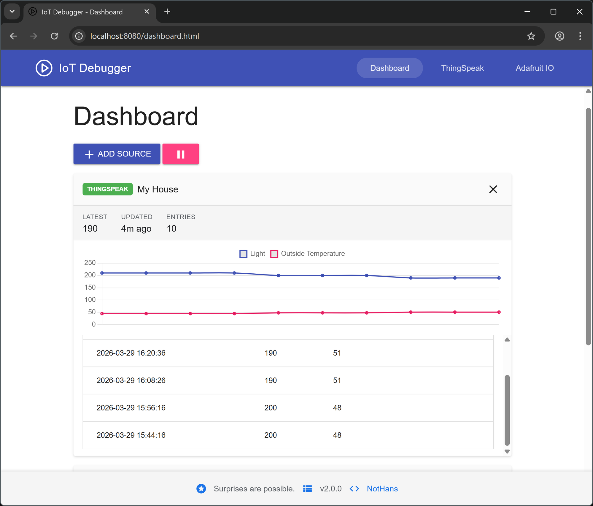

# IoT Debugger
Use this web-based tool to see data stored in an Internet of Things data service such as [ThingSpeak](https://thingspeak.com/channels/9) and [Adafruit IO](https://io.adafruit.com/).

## Demo
* [Open Demo App](https://iot-debugger.nothans.com/app/index.html)
* Click play button to start getting data

## How to Use IoT Debugger
* Download project
* Open index.html in a browser tab
* **Dashboard** - Monitor multiple ThingSpeak channels and Adafruit IO feeds at a glance
* **ThingSpeak** - Enter the ThingSpeak Channel and Read API Key and click the play button to start getting data
* **Adafruit IO** - Enter the Username, Feed Key, and API Key and click the play button to start getting data
